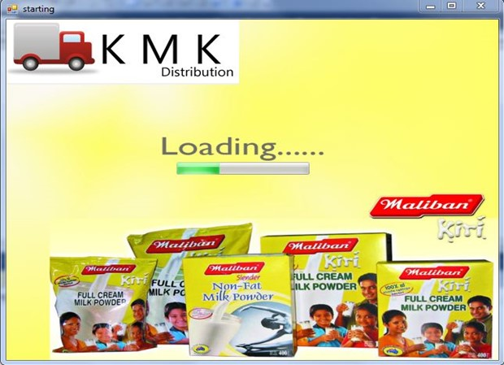
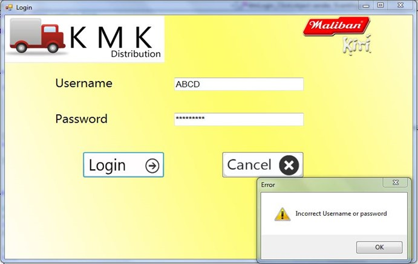
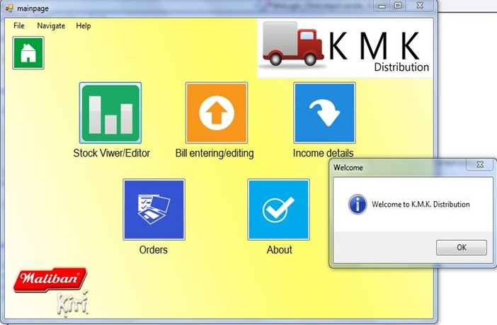
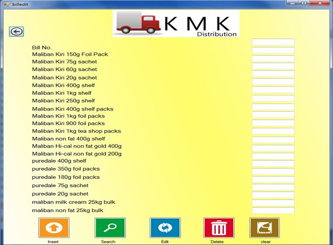
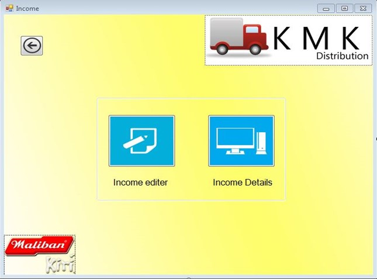
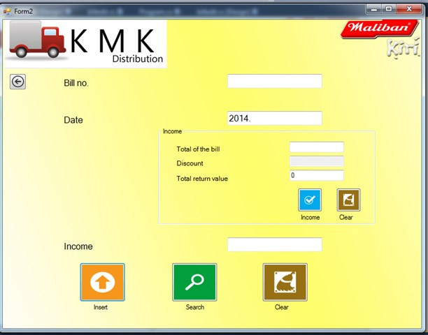

# 📦 Maliban Distribution System User Guide

Welcome to the **Maliban Distribution System**, your go-to software for managing distribution records effectively! 🚛

---

## 🔧 Program Requirements

### 🖥️ Software:
- **Visual Studio 2010**
- **C# Language**

### 💻 Hardware:
- Intel Dual Core 2.6 GHz Processor
- 2GB RAM
- 3GB Hard Disk Space

---

## 🌟 Features and How to Use

### 1️⃣ **Insert** 📝
- Enter details in the respective textboxes.
- Click the **Insert** button.
- 🛠️ The system saves your data in the database.
- ✅ A confirmation message appears upon success.


### 2️⃣ **Search** 🔍
- Input the **Bill Number** in the search textbox.
- Press the **Search** button.
- 🔄 The system retrieves and displays the relevant record, or shows "No record found" if none exists.


---

### 3️⃣ **Update** ✏️
- Enter the **Bill Number** to be updated.
- Provide new details and press the **Update** button.
- ✨ A success message confirms your changes.


### 4️⃣ **Delete** 🗑️
- Input the **Bill Number** of the record to delete.
- Click the **Delete** button.
- ⚠️ The record is permanently removed.


### 5️⃣ **Clear** 🧹
- Hit the **Clear** button to reset all textboxes.


## 💰 Income Management
- **Daily Bill Income**:
  1. Enter the **Bill Number**.
  2. Add the **Bill Data**, **Total**, and **Return Value**.
  3. Press the **Income** button to calculate the net income.


---

## 📸 Screenshots

1. 
2. 
3. 
4. 
5. 
6. 
---

## 🛠️ Installation
1. Clone the repository:
   ```bash
   git clone https://github.com/your-repo/maliban-distribution-system.git
   ```
2. Open the project in Visual Studio.
3. Build and run the project.

---

## 📜 License
This project is licensed under the MIT License. See the [Apptora] file for details.

---

**Developed with ❤️ by [Pubudu Dilshan]**
